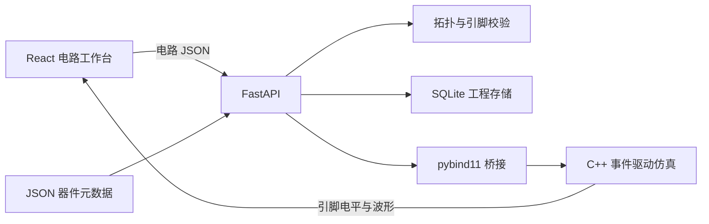

# 项目梳理与前端重构

## 项目定位与数据链路

这是面向数字逻辑课程的电路编辑与仿真平台，器件覆盖基本逻辑门、触发器/锁存器、74 系列芯片及输入输出设备。课程 PDF 是教学资料，器件行为由 C++ 实现，JSON 器件库提供前端所需的名称、分类、引脚和参数。



| 模块 | 职责与关键入口 |
| --- | --- |
| `sim-core/` | 四值逻辑 0/1/X/Z、节点与器件、事件队列、延迟传播、波形记录；主入口 `src/simulator.cpp` |
| `sim-core/src/devices/` | 门电路、锁存器/触发器、编码器/译码器、选择器、运算器、寄存器、计数器及 I/O 的求值函数 |
| `bindings/python/` | 将 Python 字典转换为 C++ 电路与仿真选项，再返回节点值和波形；目前暴露完整 `run()` |
| `backend/app/api/` | 器件查询、工程 CRUD、电路校验、仿真运行/复位接口 |
| `backend/app/services/` | 合并输入/输出引脚及器件别名；检查重复 ID、非法器件/引脚、同一网络的输出冲突和悬空输入；调用核心引擎 |
| `backend/app/storage/` | SQLite 保存工程元数据和完整电路 JSON |
| `device-library/` | 器件索引、4 类元数据文件；设备定义的 `pins` 和 `output_pins` 在后端统一为 `pins` |
| `frontend/` | React 19、TypeScript、Vite、Zustand；原生 SVG 电路与波形，无额外 UI 或画布框架 |
| `start.sh` | 安装与构建依赖，启动 8000 后端、5173 前端 |
| `start.cmd` / `start.ps1` | 原生 Windows 依赖准备、MSVC 编译、服务启动/停止/状态；详见 [Windows 使用指南](Windows使用指南.md) |
| `scripts/test-all.sh` | C++ 构建与测试，以及直接运行 Python 绑定 smoke 脚本 |

电路格式保留 `version/devices/wires`：器件含 `id/type/x/y/params`，连线含两个 `device/pin` 端点。绘图坐标只在前端使用，后端构建仿真电路时忽略坐标。所有接口和存量工程格式保持兼容。

## 重构前发现的问题

- 五个界面组件分别维护大量行内样式，颜色、字号、间距与交互状态分散。
- 画布直接使用屏幕像素坐标，缺少缩放、平移和适应内容；器件较多时操作困难。
- 已有工程保存/加载 store 与 API 方法，但工具栏只提供 PNG 保存。
- 器件分类筛选部分分支提前返回，导致芯片分类内搜索失效；搜索区分大小写。
- 新器件没有继承器件库的参数默认值。
- 引脚属性显示最终电平，画布显示回放时刻，二者可能不一致。
- 已返回 `status=error` 的仿真结果可能显示为成功；编辑/复位过程中返回的旧请求也可能覆盖新状态。
- 相同网络映射到多个示波器通道时，重复使用服务端信号 ID 作为 React key。
- 前端把 CLOCK `initial` 传成字符串、占空比传成浮点 `duty`；绑定实际消费整数 `initial` 和 `duty_pct`。
- 原 README 将绑定 smoke 脚本描述为 pytest 测试，但该脚本由 `main()` 向测试函数传入模块，应直接用 Python 执行。

## 前端重构结果

界面统一为 Logic Lab 中文实验工作台：顶部工程操作与仿真工具栏、左侧器件库、中央电路画布、右侧属性与 I/O、底部数字示波器及状态栏。采用统一 CSS 变量、SVG 图标与器件符号，支持键盘焦点和减少动画偏好，不依赖远程字体或图片。

### 组件与领域逻辑

| 位置 | 负责的行为 |
| --- | --- |
| `App.tsx` | 工作区布局、窄屏侧栏、后端健康状态、电路提示 |
| `Toolbar.tsx` | 工程入口、导出反馈、运行/复位、仿真时长、快捷键、帮助 |
| `DevicePanel.tsx` | 分类与搜索联合过滤、分组折叠、拖拽或点击添加、宽度调节 |
| `CircuitCanvas.tsx` | SVG 视口变换、Pointer Events 拖动、引脚连线、实时电平、缩放/平移、内容适应 |
| `PropertyPanel.tsx` | 参数配置、悬空提示、游标时刻引脚值、通道选择 |
| `Oscilloscope.tsx` | 时钟常驻通道、独立通道标识、完整波形、X/Z 区分、时间定位、暂停/继续、缩放、面板高度调节与折叠 |
| `ProjectDialog.tsx` / `Modal.tsx` | 原生模态弹窗、保存与打开工程、未保存更改提示、请求失败重试 |
| `lib/devices.ts` | 固定信号源、名称处理、搜索、参数默认值 |
| `lib/geometry.ts` | 网格吸附、器件边界、引脚坐标、连线布线 |
| `lib/signals.ts` | 信号颜色、网络遍历、波形查找、按时间读取信号 |
| `lib/examples.ts` | 使用真实 I0/I1/Y 引脚的半加器示例 |
| `lib/export.ts` | 当前视口的 2 倍像素 PNG 导出、资源释放与错误反馈 |
| `store/useStore.ts` | 电路编辑、最多 50 次撤销历史、工程身份与保存快照、仿真请求失效、波形回放 |

### 状态与边界约定

1. 添加、删除、连线和参数修改会使仿真结果失效；移动只改变坐标。一次拖动生成一条撤销记录，撤销后继续编辑会清除重做分支。
2. 仿真请求带有递增令牌。电路拓扑/参数改变、撤销/重做、复位或切换工程后，旧请求的结果被丢弃。
3. 保存记录请求开始时的电路快照。保存期间发生的编辑仍显示为未保存；已有工程使用 PUT 更新。新建成功但写入失败时保留工程 ID，重试不会重复创建。
4. 新建和打开工程会清理选择、连线起点、仿真回放和撤销历史；清空画布保留三个固定源，并可撤销。
5. 画布、属性面板与示波器使用同一信号查询逻辑。优先匹配 `device.pin`，兼容旧 `record_all` 的短节点名。
6. CLOCK 运行前统一转换为整数参数，兼容旧工程中的字符串初值和浮点占空比。
7. 后端断连时显示器件加载错误、重试入口与状态栏；网络请求有超时。错误仿真结果不会启动回放。

## 使用与维护

| 操作 | 方式 |
| --- | --- |
| 添加器件 | 从器件库拖入画布，或点击卡片添加到当前视口中心附近 |
| 连线 | 依次点击两个引脚；再次点击起点或按 Esc 取消 |
| 平移 / 缩放 | 平移工具、空格加拖动、中键拖动；滚轮或右下角缩放按钮 |
| 适应内容 | F 或左上角适应画布按钮 |
| 撤销 / 重做 | Ctrl/⌘+Z；Ctrl/⌘+Shift+Z 或 Ctrl+Y |
| 保存 / 运行 | Ctrl/⌘+S；Ctrl/⌘+Enter |
| 查看波形 | 选中器件后点击“在示波器显示”；CLOCK 始终显示 |
| 查看某一时刻 | 时间滑块或点击波形；“最终状态”显示最终节点值 |
| 窄屏编辑 | 900px 以下通过“器件库”和“属性”按钮打开侧栏 |

前端检查：

```bash
cd frontend
npm run build
npm run lint
npx vitest run
```

## 当前边界

- `/api/simulations/step` 仍是后端占位实现；前端时间回放使用已计算的波形，不将其包装为引擎单步仿真。
- 导出的 PNG 对应当前画布视口。大型电路可先使用“适应画布”再导出。
- 草稿不自动写入浏览器存储；需要保留的电路应点击保存工程。
- C++ 引擎的时钟求值、事件推进与延迟语义沿用现有实现；本次只修正前端参数类型和显示一致性。

## 验证结果（2026-10-03）

| 检查 | 结果 |
| --- | --- |
| TypeScript 与 Vite 生产构建 | 通过 |
| ESLint | 通过 |
| 前端 Vitest | 4 个文件，60 项通过；含 27 项新增回归测试 |
| 后端 pytest | 62 项通过 |
| C++ CTest | 9 个测试套件全部通过 |
| Python 绑定 smoke 脚本 | 6 项检查通过 |
| Git diff 空白与冲突检查 | 通过 |

使用真实 FastAPI 与 C++ 绑定在浏览器中完成半加器运行、暂停与最终状态切换、器件选择、示波器通道选择、工程保存及重新打开。输入 A=1/B=0 时，和位为 1、进位为 0；输入 A=1/B=1 时，和位为 0、进位为 1，画布引脚和指示灯一致。PNG 生成流程返回成功提示。

在桌面、390px 与 320px 宽度检查布局。窄屏器件库及属性抽屉可使用，320px 时工具栏换行，运行按钮完整可见。修复了浏览器 SVG 指针捕获导致点击后选区被清除的问题，并加入回归测试。

后端测试仍有现有 FastAPI `on_event` 弃用提示，不影响测试结果。本次未修改后端或仿真核心。
